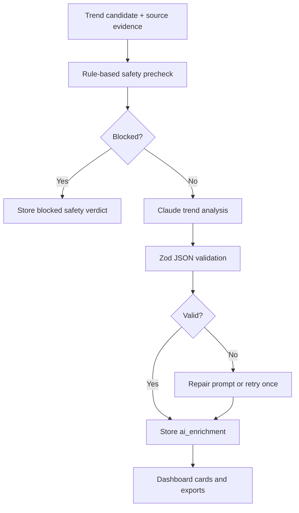

# AI Integration

## AI Goals

Use Claude API to turn raw trend evidence into seller-ready outputs:

- Design prompts per niche.
- Trend analysis and scoring explanations.
- Niche suggestions based on calendar events.
- Phrase variations.
- Listing keywords.
- Safety warnings.
- Platform-specific upload notes.

The AI layer should enrich scored data. It should not be the only source of truth for trend detection or competition metrics.

Official Claude references:

- API overview: https://platform.claude.com/docs/en/api/overview
- Messages API: https://platform.claude.com/docs/en/api/messages/create

## AI Architecture



## Prompting Rules

Claude outputs must be:

- JSON only.
- Validated against a schema.
- Platform-safe.
- Free of exact copyrighted slogans unless the user owns rights.
- Free of brand/team/celebrity names unless explicitly licensed.
- POD-focused: flat graphic, no mockup, no garment photo, no mannequin.
- Specific enough for image generation.
- Clear enough for a human designer.

## Data Sent To Claude

Send compact evidence, not entire raw pages:

```json
{
  "phrase": "Living My Best Chaotic Life",
  "niche": "coffee_lifestyle",
  "sources": [
    {
      "source": "google_search",
      "title": "woman fined for pouring coffee down drain",
      "observedAt": "2026-05-08T00:49:00Z"
    }
  ],
  "metrics": {
    "amazonCompetition": "ultra_niche",
    "etsyCompetition": "unknown",
    "googleTrendVelocity": 61,
    "sourceEnergy": 14,
    "momentScore": 7,
    "daysUntilEvent": null
  },
  "safety": {
    "precheckVerdict": "review",
    "avoid": ["specific real person claims", "defamatory wording"]
  }
}
```

## Output Schema

```ts
import { z } from "zod";

export const AiTrendEnrichmentSchema = z.object({
  normalizedPhrase: z.string(),
  qualityVerdict: z.enum(["strong", "usable", "weak", "reject"]),
  whyNow: z.string(),
  targetBuyer: z.string(),
  designStyle: z.string(),
  safetyVerdict: z.enum(["safe", "review", "blocked"]),
  safetyNotes: z.array(z.string()),
  phraseVariations: z.array(z.object({
    phrase: z.string(),
    angle: z.string(),
    risk: z.enum(["low", "medium", "high"])
  })).min(3).max(5),
  designPrompts: z.array(z.object({
    title: z.string(),
    prompt: z.string(),
    platformFit: z.array(z.enum(["amazon", "etsy", "redbubble"])),
    styleTags: z.array(z.string())
  })).min(5).max(5),
  listingKeywords: z.array(z.string()).min(10).max(40),
  platformNotes: z.object({
    amazon: z.string(),
    etsy: z.string(),
    redbubble: z.string()
  })
});
```

## Claude API Call Structure

```ts
import Anthropic from "@anthropic-ai/sdk";
import { AiTrendEnrichmentSchema } from "@/server/ai/schemas";

const anthropic = new Anthropic({
  apiKey: process.env.ANTHROPIC_API_KEY
});

export async function generateTrendEnrichment(input: unknown) {
  const message = await anthropic.messages.create({
    model: process.env.CLAUDE_MODEL ?? "claude-sonnet-4-5",
    max_tokens: 3000,
    system: [
      "You are a POD trend analyst for Amazon Merch, Etsy, and Redbubble.",
      "Return JSON only.",
      "Do not include copyrighted characters, team names, brand names, celebrity names, or protected event names unless the input explicitly says licensed.",
      "Design prompts must describe flat printable artwork, not t-shirt mockups."
    ].join(" "),
    messages: [
      {
        role: "user",
        content: JSON.stringify({
          task: "Generate a safe POD trend enrichment.",
          input
        })
      }
    ]
  });

  const text = message.content
    .filter((block) => block.type === "text")
    .map((block) => block.text)
    .join("");

  return AiTrendEnrichmentSchema.parse(JSON.parse(text));
}
```

## Prompt Template: Design Prompts Per Niche

```text
You are generating print-on-demand design prompts.

Input:
{{trend_json}}

Requirements:
- Return JSON only.
- Create exactly 5 design prompts.
- Each prompt must be for flat printable graphic artwork.
- Include strong typography direction, central visual, palette, layout, and background.
- Include "NO t-shirt mockup, NO clothing, NO mannequin".
- Avoid protected brands, celebrities, teams, leagues, copyrighted characters, and exact slogans.
- If the phrase is awkward or unsafe, mark qualityVerdict as "reject" and suggest safer alternatives.

JSON shape:
{
  "normalizedPhrase": "...",
  "qualityVerdict": "strong|usable|weak|reject",
  "whyNow": "...",
  "targetBuyer": "...",
  "designStyle": "...",
  "safetyVerdict": "safe|review|blocked",
  "safetyNotes": ["..."],
  "phraseVariations": [
    {"phrase":"...", "angle":"...", "risk":"low|medium|high"}
  ],
  "designPrompts": [
    {
      "title": "...",
      "prompt": "...",
      "platformFit": ["amazon","etsy","redbubble"],
      "styleTags": ["..."]
    }
  ],
  "listingKeywords": ["..."],
  "platformNotes": {
    "amazon": "...",
    "etsy": "...",
    "redbubble": "..."
  }
}
```

## Prompt Template: Trend Analysis And Scoring

```text
You are scoring a POD trend candidate.

Evidence:
{{evidence_json}}

Score the trend for print-on-demand sellers.

Rules:
- Be conservative when evidence is weak.
- Penalize awkward grammar.
- Penalize high IP risk.
- Penalize phrases that only make sense with context users will not know.
- Reward evergreen buyer identity, giftability, wearability, and visual clarity.
- Output JSON only.

Return:
{
  "demand": 0-100,
  "competition": 0-100,
  "velocity": 0-100,
  "timing": 0-100,
  "platformFit": 0-100,
  "ipSafety": 0-100,
  "confidence": 0-100,
  "temperature": "hot|warm|cold",
  "decision": "design_now|test_small|watch|skip",
  "reasonCodes": ["..."],
  "warnings": ["..."],
  "explanation": "..."
}
```

## Prompt Template: Calendar Niche Suggestions

```text
You are expanding a POD calendar event into sub-niches.

Calendar event:
{{event_json}}

Generate 8 safe sub-niches for Amazon Merch, Etsy, and Redbubble.

Rules:
- Include buyer segment, phrase angle, platform fit, and design style.
- Avoid official logos, protected event branding, and celebrity references.
- Prefer generic and parody-safe phrasing.
- Output JSON only.

Return:
{
  "eventName": "...",
  "subNiches": [
    {
      "name": "...",
      "buyer": "...",
      "phraseAngles": ["..."],
      "platformFit": {
        "amazon": 0-100,
        "etsy": 0-100,
        "redbubble": 0-100
      },
      "recommendedStyle": "...",
      "riskNotes": ["..."]
    }
  ]
}
```

## AI Quality Gates

Before saving AI output:

1. Validate JSON with Zod.
2. Reject exact duplicates.
3. Run phrase variations through IP safety checks.
4. Reject prompts containing banned terms.
5. Reject prompts that mention "mockup", "model wearing", or "photo of shirt" unless as a negative instruction.
6. Check phrase grammar with a simple grammar heuristic and Claude self-review.
7. Store prompt version and model name.

## Cost Controls

Use:

- Cache by `trend_candidate_id + prompt_version + model`.
- Batch low-priority enrichments.
- Generate AI only for candidates above a threshold.
- Use token counting before expensive requests.
- Store compact evidence.

## Human Review Mode

For high-risk categories, require a review state:

- Health awareness.
- Political topics.
- Tragedies or disasters.
- Sports leagues and teams.
- Schools/universities.
- Celebrity/person names.
- Recent news involving private individuals.

Dashboard behavior:

- Show "Needs review".
- Hide copy/export until reviewed.
- Explain the specific risk.

