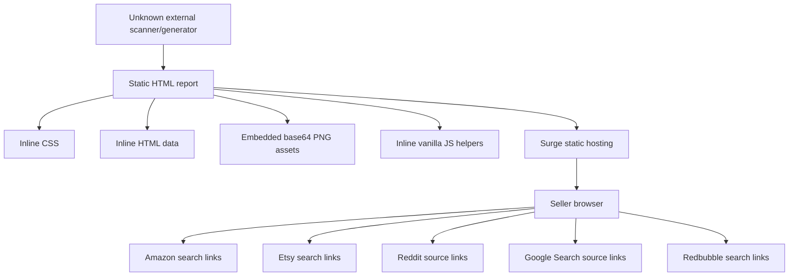
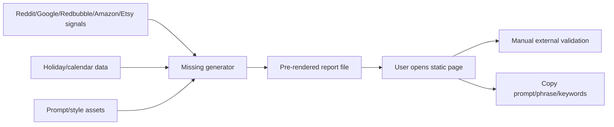
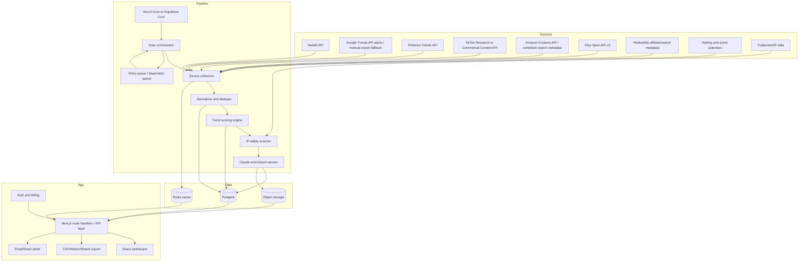
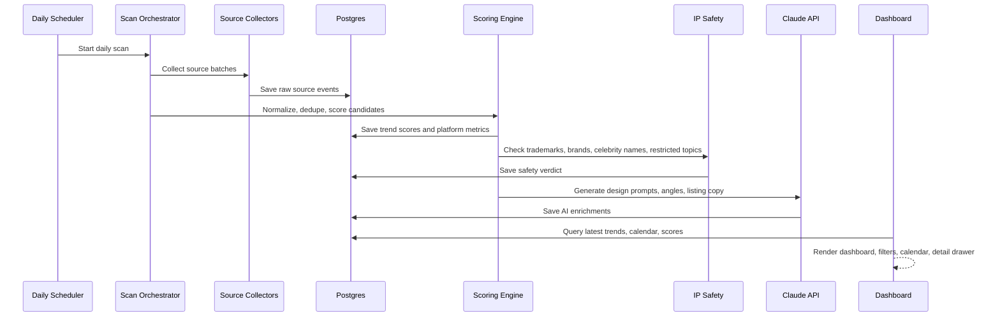

# Architecture

## Current Architecture

The current project is a static report. The codebase contains only the rendered output, not the generator that created it.

## Current Data Flow

What is observable in the source:

- The final report contains hard-coded cards.
- The report does not fetch data at runtime.
- Every score, label, prompt, and URL is already baked into the HTML.
- User interactions only change CSS classes or copy text to the clipboard.

## Current Runtime Components

| Component | Current implementation | Responsibility |
|---|---|---|
| Report shell | Static HTML | Header, metrics, calendar, trend grid, footer |
| Styling | Inline CSS | Dark theme, grid layout, cards, badges, collapsible sections |
| Calendar data | Hard-coded HTML | 30 upcoming POD opportunities |
| Trend data | Hard-coded HTML | 18 trend cards with scores and prompts |
| Images | Base64 PNG data URIs | Logo and visual style references |
| Interactions | Inline JS | Expand/collapse and clipboard copy |
| Hosting | Surge | Static report delivery |

## Recommended Rebuild Architecture

The rebuild should be a real full-stack SaaS with persistent data, scheduled collection, AI enrichment, and a dashboard.

## Recommended Data Flow

## Main Domain Objects

- `trend_candidate`: One detected phrase, topic, event, or niche idea.
- `source_event`: Raw observation from Reddit, Google Trends, Pinterest, TikTok, Etsy, Amazon, Redbubble, or a calendar.
- `platform_metric`: Demand and competition evidence for a platform.
- `trend_score`: Normalized hot/warm/cold score with component scores.
- `ai_enrichment`: Design prompts, listing keywords, angles, warnings, and summaries.
- `calendar_event`: Upcoming holiday or event with upload windows and sub-niches.
- `ip_safety_check`: Trademark, brand, celebrity, policy, and restricted-topic signals.
- `scan_run`: One scheduled scan execution with status, timing, and error logs.

## Architecture Principles For The Rebuild

- Store raw source events before interpretation.
- Treat scores as reproducible calculations, not static text.
- Make each collector isolated so one source failure does not break the scan.
- Prefer official APIs and partner programs over scraping.
- Use queues and retry state for long scans.
- Cache expensive external results.
- Put IP safety before AI prompt generation.
- Keep dashboard reads fast with precomputed score snapshots.
- Preserve every prompt and score version for auditability.

