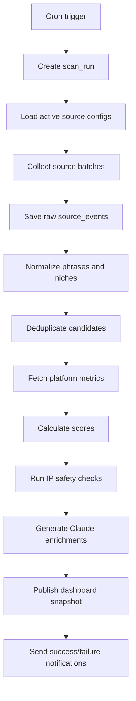

# Automation Pipeline

## Goal

Build a fully automated daily scan that runs without manual work, stores evidence, scores opportunities, generates AI enrichments, and publishes the latest dashboard.

## Recommended Daily Schedule

For US POD sellers, run once per day early enough to act before the US workday:

- 09:00 UTC daily.
- Equivalent to 05:00 Eastern during daylight saving time.

For Vercel Cron, note that Vercel cron expressions run in UTC.

## Pipeline Overview



## Scan Steps

### 1. Create Scan Run

Create a `scan_runs` row with status `running`.

```ts
const scanRun = await db.insert(scanRuns).values({
  status: "running",
  startedAt: new Date(),
  metadata: { trigger: "daily-cron" }
}).returning();
```

### 2. Collect Sources

Collectors should be independent modules:

```ts
export interface SourceCollector {
  id: string;
  collect(input: CollectInput): Promise<SourceEventInput[]>;
}
```

Suggested collectors:

- `reddit-rising.collector.ts`
- `google-trends.collector.ts`
- `pinterest-trends.collector.ts`
- `etsy-search.collector.ts`
- `amazon-creators.collector.ts`
- `redbubble-search.collector.ts`
- `holiday-calendar.collector.ts`

### 3. Normalize And Dedupe

Use deterministic normalization:

```ts
export function normalizePhrase(input: string) {
  return input
    .toLowerCase()
    .replace(/&/g, "and")
    .replace(/[^a-z0-9\s]/g, " ")
    .replace(/\s+/g, " ")
    .trim();
}
```

Also use embeddings for near-duplicates:

- "class of 2026 senior shirt"
- "senior class 2026 shirt"
- "2026 graduation senior tee"

These should become one candidate family with multiple angles.

### 4. Fetch Platform Metrics

For each candidate, fetch or estimate:

- Amazon result/product evidence.
- Etsy listing evidence.
- Redbubble marketplace evidence.
- Google Trends trend evidence.
- Pinterest/TikTok/Reddit velocity evidence.

Store each metric independently so failures do not destroy the whole score.

### 5. Score Candidates

Calculate:

- Demand.
- Competition.
- Velocity.
- Timing.
- Platform fit.
- IP safety.
- Confidence.
- Total score.
- Hot/warm/cold temperature.

### 6. Generate AI Enrichments

Only call Claude when:

- Candidate is not blocked by IP safety.
- Candidate score is above a minimum threshold.
- Candidate has enough evidence.

Generate:

- Why now.
- Target buyer.
- 5 design prompts.
- 3 phrase variations.
- Listing keywords.
- Safety warnings.
- Platform notes.

### 7. Publish Dashboard Snapshot

The dashboard should query the database live, but also create a daily snapshot record for:

- Fast initial load.
- Audit history.
- Shareable daily report.
- Email digest.

## Vercel Cron Setup

`vercel.json`:

```json
{
  "crons": [
    {
      "path": "/api/cron/daily-scan",
      "schedule": "0 9 * * *"
    }
  ]
}
```

`app/api/cron/daily-scan/route.ts`:

```ts
import { NextRequest, NextResponse } from "next/server";
import { enqueueDailyScan } from "@/server/jobs/enqueue-daily-scan";

export async function GET(req: NextRequest) {
  const auth = req.headers.get("authorization");
  if (auth !== `Bearer ${process.env.CRON_SECRET}`) {
    return NextResponse.json({ error: "unauthorized" }, { status: 401 });
  }

  const job = await enqueueDailyScan({ trigger: "vercel-cron" });
  return NextResponse.json({ ok: true, jobId: job.id });
}
```

Vercel documents `CRON_SECRET` as the recommended way to secure cron invocations:

- https://vercel.com/docs/cron-jobs/manage-cron-jobs

## Supabase Cron Alternative

Supabase Cron can call an Edge Function or run SQL through `pg_cron`.

Example:

```sql
select cron.schedule(
  'daily-trend-scan',
  '0 9 * * *',
  $$
  select net.http_post(
    url := 'https://your-project.supabase.co/functions/v1/daily-scan',
    headers := jsonb_build_object(
      'Content-Type', 'application/json',
      'Authorization', 'Bearer ' || current_setting('app.cron_secret')
    ),
    body := jsonb_build_object('trigger', 'supabase-cron')
  );
  $$
);
```

Official reference:

- https://supabase.com/docs/guides/cron

## Error Handling

### Per-Source Failure Isolation

Each collector writes status independently:

```ts
type SourceRunStatus = {
  source: string;
  status: "succeeded" | "failed" | "partial";
  recordsFetched: number;
  error?: string;
};
```

If Pinterest fails, Reddit and Etsy should still complete.

### Retry Strategy

Use exponential backoff:

```ts
const retryDelays = [30_000, 120_000, 600_000];
```

Retry only transient errors:

- 408 timeout.
- 429 rate limited.
- 500/502/503/504 upstream errors.
- Network resets.

Do not retry:

- 400 validation errors.
- 401/403 credential errors.
- Policy-blocked source configs.

### Rate Limit Handling

For each external service:

- Store remaining quota in Redis.
- Respect `Retry-After` headers.
- Use per-source concurrency limits.
- Cache repeated query results for at least 12-24 hours.

### Dead Letter Queue

Failed source jobs after all retries should be stored:

```sql
create table failed_jobs (
  id uuid primary key default gen_random_uuid(),
  job_type text not null,
  payload jsonb not null,
  error text not null,
  failed_at timestamptz not null default now(),
  retry_count int not null
);
```

### Alerts

Send alerts when:

- Full scan fails.
- More than 30 percent of sources fail.
- Claude enrichment fails for all candidates.
- Database writes fail.
- No hot or warm trends are produced.
- Scan duration exceeds expected window.

Recommended channels:

- Email.
- Slack webhook.
- Sentry alert.

## Idempotency

Every scan should be safe to rerun.

Use:

- `scan_run_id` for run-level grouping.
- Unique constraints on `(source, external_id)`.
- Upserts for `trend_candidates.normalized_phrase`.
- Deterministic prompt hashes for AI output.

## Deployment And 24/7 Operation

Recommended production setup:

- Vercel hosts dashboard and cron trigger.
- Supabase hosts Postgres and optional Cron backup.
- Upstash stores cache and rate-limit state.
- Sentry monitors errors.
- Axiom/Better Stack stores logs.
- GitHub Actions runs tests before deploy.

Operational checks:

- Daily scan success rate.
- Average scan duration.
- External API error rate.
- Number of new candidates.
- Number of hot/warm/cold trends.
- Claude cost per scan.
- User engagement with saved/exported trends.

## Backfill Jobs

Backfill should run separately from daily scans:

```ts
type BackfillJob = {
  source: string;
  from: string;
  to: string;
  batchSize: number;
  dryRun: boolean;
};
```

Use backfills for:

- Historical Google Trends.
- Calendar generation for the next 12 months.
- Re-scoring older trends after formula changes.
- Re-running AI prompts with a new prompt version.

## Release Safety

Before enabling a new source in production:

1. Run it in dry-run mode.
2. Store raw output in a staging table.
3. Validate schema coverage.
4. Confirm legal/API terms.
5. Add rate-limit config.
6. Add source-specific tests.
7. Enable for 10 percent of scans.
8. Monitor errors and cost.
9. Roll out fully.

